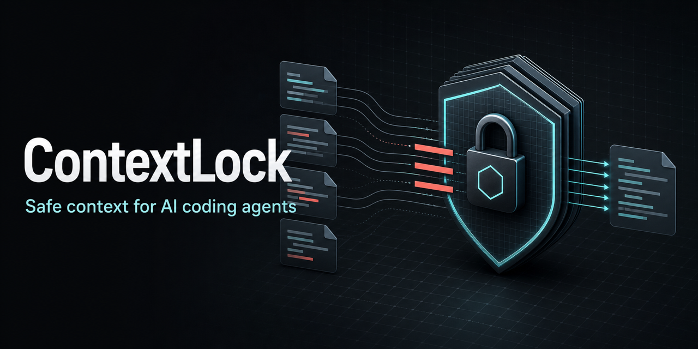

<div align="center">
  

# ContextLock

**A local-first MCP safety layer for AI coding agents.**

Block sensitive files and redact common secrets before repository context reaches an AI client.

[](https://github.com/LutaElbert/contextlock/actions/workflows/ci.yml)
[](https://github.com/LutaElbert/contextlock/releases)
[](LICENSE)

</div>

> [!IMPORTANT]
> ContextLock is in early development (`0.x`). APIs and policy behavior may
> change before the first stable release. The npm package is not published yet;
> use the source-based setup below for the current release.

## Why ContextLock?

AI coding agents are more useful with repository context, but real projects can
contain `.env` files, private keys, database URLs, credentials, webhooks, and
client data. ContextLock provides a controlled local boundary between an
MCP-compatible AI client and a project:

```text
AI coding client
      |
      | local stdio MCP
      v
 ContextLock
      |
      | block files + redact values + report risks
      v
 Local repository
```

- **Local-first:** repository content is processed on your machine.
- **Blocked by policy:** sensitive files never appear in safe file listings or
  reads.
- **Redacted before return:** supported secret patterns are replaced with clear
  placeholders.
- **Inspectable:** scan and report commands show what the active policy finds.
- **Configurable:** each project can maintain its own policy file.

## Quick Start

ContextLock requires Node.js 22.13+ and pnpm 11.

```bash
git clone git@github.com:LutaElbert/contextlock.git
cd contextlock
pnpm install --frozen-lockfile
pnpm build
```

Initialize a policy in the repository you want to protect, then scan it:

```bash
cd /path/to/your/project
node /path/to/contextlock/dist/cli.js init
node /path/to/contextlock/dist/cli.js scan
node /path/to/contextlock/dist/cli.js report
```

Start the MCP server from the project being protected:

```bash
node /path/to/contextlock/dist/cli.js mcp
```

When ContextLock is published to npm, the equivalent commands will be:

```bash
npx contextlock init
npx contextlock scan
npx contextlock mcp
```

## MCP Client Setup

Add a server entry to your MCP-compatible client and set the command path to
the ContextLock build on your machine:

```json
{
  "mcpServers": {
    "contextlock": {
      "command": "node",
      "args": ["/absolute/path/to/contextlock/dist/cli.js", "mcp"]
    }
  }
}
```

The MCP client should launch ContextLock with the protected repository as its
working directory. After npm publication, run `contextlock mcp-config` to print
a generic `npx` configuration snippet.

## MCP Tools

| Tool | Purpose |
| --- | --- |
| `repo.list_files` | List text files allowed by the active policy. |
| `repo.read_file_safe` | Read an allowed file with supported secrets redacted. |
| `repo.search_safe` | Search allowed text content and return redacted snippets. |
| `repo.scan_risks` | Summarize blocked files and detected secret patterns. |
| `policy.explain` | Show the active blocking and redaction policy. |

## Default Protection

Running `contextlock init` creates `contextlock.config.json`. The default policy
blocks common sensitive or generated paths, including:

- `.env` files, private keys, credentials, service-account files, and database
  files
- dependency and build output such as `node_modules`, `dist`, `.next`, and
  `.turbo`
- Git internals under `.git`

Allowed text files are scanned for supported API keys, JWTs, database URLs,
private keys, and Slack or Discord webhook URLs. Email redaction is available
but disabled by default.

Example configuration:

```json
{
  "blockedPatterns": [
    ".env",
    ".env.*",
    "**/*.pem",
    "**/*.key",
    "**/credentials.json",
    "**/node_modules/**",
    "**/.git/**"
  ],
  "redact": {
    "apiKeys": true,
    "jwt": true,
    "databaseUrls": true,
    "privateKeys": true,
    "webhooks": true,
    "emails": false
  }
}
```

> [!WARNING]
> ContextLock reduces accidental exposure; it is not a secret manager, malware
> scanner, sandbox, or guarantee that every sensitive value will be detected.
> Keep credentials out of source control and review your project policy before
> granting an AI client access.

## Development

```bash
pnpm install --frozen-lockfile
pnpm typecheck
pnpm test:mcp
pnpm pack --dry-run
```

`pnpm test:mcp` builds the CLI, connects as a real stdio MCP client, verifies
tool discovery, and exercises policy, file-listing, and safe-read behavior. CI
runs the same smoke test on Node.js 22 and 24.

For development against this repository:

```bash
pnpm dev -- scan
pnpm dev -- mcp
pnpm dev -- mcp-config --local
```

## Roadmap

- Expand secret detection and policy test coverage.
- Improve audit reports and machine-readable findings.
- Publish the CLI package to npm.
- Add premium policy packs, team policy sync, database sanitization, and
  enterprise audit exports without weakening the local-first core.

Core promise: **No cloud required. Your code stays local.**

## Releases

GitHub releases are created manually through the
[Release workflow](https://github.com/LutaElbert/contextlock/actions/workflows/release.yml)
after the package version is updated on `main`.

1. Update `package.json` to the next version in a pull request.
2. Merge the pull request into `main`.
3. Open the **Release** workflow and choose **Run workflow**.
4. Enter the matching tag, such as `v0.1.1`, and run it.

The workflow installs dependencies, runs type checks and the MCP smoke test,
performs a package dry run, validates the tag, and creates the GitHub release.

## Contributing

Contributions are welcome. Read [CONTRIBUTING.md](CONTRIBUTING.md) before opening
a pull request, follow the [Code of Conduct](CODE_OF_CONDUCT.md), and use only
synthetic or redacted test data.

Report vulnerabilities privately according to [SECURITY.md](SECURITY.md).

## License

ContextLock is licensed under the [Apache License 2.0](LICENSE).
